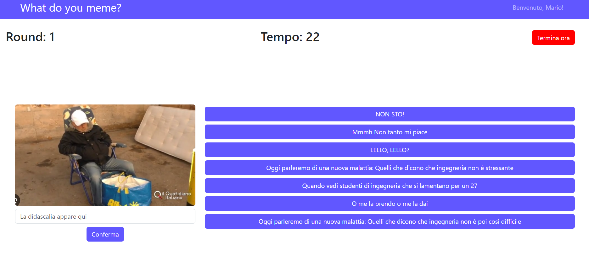
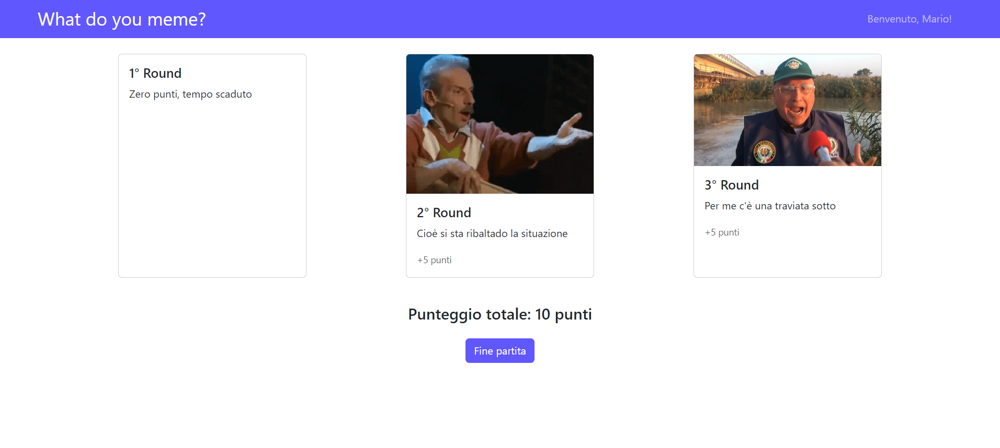

[](https://classroom.github.com/a/J0Dv0VMM)
# Exam #1: "Gioco dei Meme"
## Student: s331156 RAFFAELE GABRIELE 

## React Client Application Routes

- Route `/`: è la pagina iniziale sel sistema, permette di effettuare il login o di usufruire del sistema come guest
- Route `/start`: pagina comune a guest e utente loggato, permette di iniziare una partita e di consultare la pagina utente
- Route `/start/game`: pagina di gioco, comune a guest e utente loggato
- Route `/review` : pagina di review, appartiene all'utente loggato. Viene stampata alla fine dei tre round, presenta un riepilogo della partita
- Route `/profile`: pagina di profilo dell'utente loggato, consente la visualizzazione delle informazioni e permette l'accesso alla cronologia 
- Route `/profile/history`: pagina appartentene all'utente loggato, consente la visualizzazione dei dettagli sulle partite giocate

## API Server

- POST `/api/round`
  - Description: aggiunge un nuovo round ad un utente autenticato
  - Request parameters: _None_ 
  - Request body: descrizione del game e delle didascalie del round
  ``` JSON
  
    {"game":{
      "id": 2,
      "user": 1,
      "round": 1,
      "score": 0,
      "meme_id": 4,
      "choice": 1
      },
      "captions" : [{"id": 1, "description": "bla"},...,{"id": 7, "description": "bla"}]
    }
    
  ```
  - Response: `200 OK` (success)
  - Response body: un oggetto che descrive il game e le didascalie corrette:

  ``` JSON
  
    {"game":{
      "id": 2,
      "user": 1,
      "round": 1,
      "score": 0,
      "meme_id": 4,
      "choice": 1},
      "correctCaptions":{ [{"id": 1, "description": "bla"},{"id": 2, "description": "bla"}]
      } 
    }
  
  ```

- Error responses: `422 Unprocessable Entity` (invalid input), `503 Service Unavailable` (database error), `401 Unauthorized User`(not authorized)

- POST `/api/game/guest`
  - Description: permette il recupero e la verifica delle didascalie corrette per utenti guest
  - Request parameters: _None_ 
  - Request body: descrizione del meme_id, delle sette didascalie del round e della didascalia scelta:
   ``` JSON
  
    {"memeId": 2,  
    "captions" : [{"id": 1, "description": "bla"},...,{"id": 7,"description": "bla"}], 
    "choice": 1
    }
    
  ```
  - Response: `200 OK` (success)
  - Response body: oggetto che descrive le didascalie corrette e un booleano che suggerisce se la didascalia scelta è corretta

  ``` JSON
  
    {"correctCaptions":[{"id": 1, "description": "bla"},{"id": 2, "description": "bla"}],
    "isCorrect": "true"
    }
  
  ```

- Error responses:  `503 Service Unavailable` (database error)
- GET `/api/games`
  - Description: recupera tutti i giochi di un dato utente autenticato
  - Request parameters: _None_
  - Request body: _None_
  - Response: `200 OK` (success)
  - Response body: un array di giochi
  
  ``` JSON
    {[{"id": 1,
      "user": 1,
      "round": 1,
      "score": 0,
      "meme_id": 4,
      "choice": 1},{"id": 2,
      "user": 1,
      "round": 1,
      "score": 0,
      "meme_id": 4,
      "choice": 1}, ...]}
  ```
  - Error responses: `500 Internal Server Error` (generic error), `401 Unauthorized User`(not authorized)

- GET `/api/games/:id`
  - Description: recupera tutti i round di un game per un utente autenticato
  - Request parameters: id del game
  - Request body: _None_
  - Response: `200 OK` (success)
  - Response body: 
  ``` JSON
    {[{"id": 3,
      "user": 1,
      "round": 1,
      "score": 0,
      "meme_id": 4,
      "choice": 1,
      "description":"bla",
      "image": "image1.jpg"
      },{"id": 3,
      "user": 1,
      "round": 2,
      "score": 0,
      "meme_id": 4,
      "choice": 1,
      "description":"bla",
      "image": "image2.jpg"},
      {"id": 3,
      "user": 1,
      "round": 3,
      "score": 0,
      "meme_id": 4,
      "choice": 1,
      "description":"bla",
      "image": "image3.jpg"}]}
  ```
  - Error responses: `500 Internal Server Error` (generic error), `401 Unauthorized User`(not authorized)

- GET `/api/round/:memeId/random`
  - Description: recupera sette didasclie randomiche per un round dato un memeId
  - Request parameters: memeId
  - Request body: _None_
  - Response: `200 OK` (success)
  - Response body: 
    ``` JSON
      {[{"id": 1, "description": "bla"},...,{"id": 7, "description": "bla"}]}
    ```
  - Error responses: `500 Internal Server Error` (generic error), `404 Not Found` (not present or unavailable)

- GET `/api/game/random`
  - Description: ritorna in maniera randomica un meme per utente guest
  - Request parameters: _None_
  - Request body: _None_
  - Response: `200 OK` (success)
  - Response body: 
    ``` JSON
        {"id": 1, "image": "image1.jpg"}
    ```
  - Error responses: `500 Internal Server Error` (generic error), `404 Not Found` (not present or unavailable)

- GET `/api/game/:gameId/:round/meme`
  - Description: recupera meme in maniera randomica per round, dell'utente autenticato, evitando duplicati
  - Request parameters: gameId, round
  - Request body: _None_
  - Response: `200 OK` (success)
  - Response body: 
  ``` JSON
  {"id": 1, "image": "image1.jpg"}
  ```
  - Error responses: `500 Internal Server Error` (generic error), `404 Not Found` (not present or unavailable), `401 Unauthorized User`(not authorized)

- GET `/api/game/last`
  - Description: recupera l'id dell'ultimo game giocato, se non presente ritorna 0
  - Request parameters: _None_
  - Request body:_None_
  - Response: `200 OK` (success)
  - Response body:
  ``` JSON
    3
  ```
  - Error responses: `500 Internal Server Error` (generic error), `401 Unauthorized User`(not authorized)
- GET `/api/review`
  - Description: recupera tutte le informazioni dei round dell'ultimo game giocato
  - Request parameters: _None_
  - Request body:_None_
  - Response: `200 OK` (success)
  - Response body:
  ``` JSON  
  {[{"id": 3,
      "user": 1,
      "round": 1,
      "score": 0,
      "meme_id": 4,
      "choice": 1,
      "description":"bla",
      "image": "image1.jpg"
      },{"id": 3,
      "user": 1,
      "round": 2,
      "score": 0,
      "meme_id": 4,
      "choice": 1,
      "description":"bla",
      "image": "image2.jpg"},
      {"id": 3,
      "user": 1,
      "round": 3,
      "score": 0,
      "meme_id": 4,
      "choice": 1,
      "description":"bla",
      "image": "image3.jpg"}]} 
  ```
- Error responses: `500 Internal Server Error` (generic error), `404 Not Found` (not present or unavailable), `401 Unauthorized User`(not authorized)

- POST `/api/sessions`
  - Description: effettua il login
  - Request parameters: _None_
  - Request body:
  
``` JSON
{
    "username": "username",
    "password": "password"
}
```
  - Response: `200 OK` (success)
  - Response body:
``` JSON
{
    "id": 1,
    "username": "user1", 
    "name": "John",
    "email": "user1@mail.com",
    "birthday": "01-02-2000",
    "image": "profile1.jpg"
}
```
  - Error responses: `500 Internal Server Error` (generic error), `401 Unauthorized User` (login failed)

- GET `/api/sessions/current`
  - Description: Verifica che l'utente sia autenticato
  - Request parameters: _None_
  - Request body: _None_
  
  - Response: `200 OK` (success)
  - Response body:
``` JSON
{
    "id": 1,
    "username": "user1", 
    "name": "John",
    "email": "user1@mail.com",
    "birthday": "01-02-2000",
    "image": "profile1.jpg"
}
```
  - Error responses: `500 Internal Server Error` (generic error), `401 Unauthorized User` (user is not logged in)

- DELETE `/api/sessions/current`
  - Description: effettua il logout
  - Request parameters: _None_
  - Request body:_None_
  - Response: `200 OK` (success)
  - Response body:_None_

  - Error responses: `500 Internal Server Error` (generic error), `404 Not Found` (user is not logged in)


## Database Tables

- Table `Users` - contiene: id, username, name, email,birthdate, image, password, salt
- Table `Didascalie` - contiene: id, description
- Table `MDTable` - contiene:  didascalia_id, meme_id
- Table `Meme` - contiene: id, image
- Table `Games` - contiene: id, user, round, score, meme_id, choice
## Main React Components

- `GameLayout` (in `GameLayout.jsx`): Componente contente le funzionalità pricipali del gioco, permette l'utilizzo del timer, la scelta delle didascalie e lo sviluppo del gioco in sè 
- `RecapGameLayout` (in `RecapGameLayout.jsx`): permette di visualizzare il riepilogo dell'ultimo game giocato

- `LoginForm` (in `LoginForm.jsx`): Form che permette di effettuare il login o continuare come guest

- `LeftTableExample` (in `HistoryLayout.jsx`):permette la visualizzazione della storia dei game passati, è composto da due parti principali, la prima permette la visualizzazione di tutti i game per game id, la seconda dei round per ogni game id 

- `NavHeader` (in `NavHeader.jsx`): componente che permette la realizzazione di una NavBar, la quale consente l'accesso alla pagina di profilo, di effettuare il login e il logout
- `ProfileLayout` (in `ProfileLayout.jsx`): consente la visualizzazione dei dati utente, inoltre permette di accedere alla cronologia dei game

## Screenshot



## Users Credentials

- username: user1, password: user1
- username: user2, password: user2
